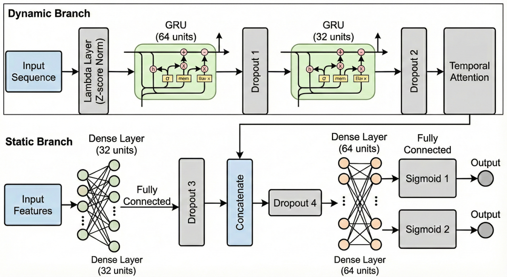
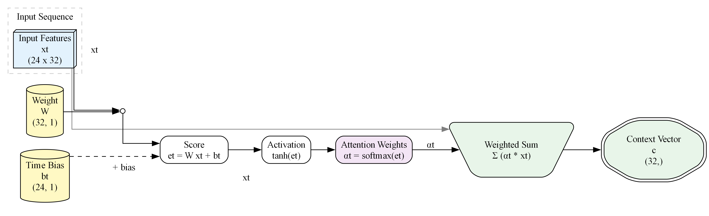

# GRU-Dense Neural Network Architecture for Predictive Monitoring of Hyperglycemia and Hypoglycemia in ICU Patients

---

> ## **Note:** This project is very recent and documentation work is currently ongoing.
